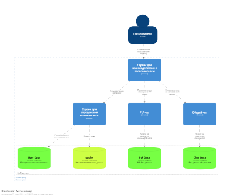

# Лр 1 Панцырный Иван Олегович М80-114М-23 Вариант 5

Задание 01: Проектирование программной системы (Architecture As A Code)
### Цель
Ознакомится с инструментами проектирования в формате Architecture As A Code.
Получить практический навык в моделировании в нотации C4

### Задание
1. Установить инструменты из списка
+ Клиент Git
+ Текстовый редактор (рекомендуется Visual Studio Code)
+ Плагины к Visual Studio Code C4 DSL
2. Зарегистрироваться на github.com (если еще нет учетной записи)
3. Создать публичный репозиторий для выполнения практической работы у себя в
аккаунте
4. Скопировать репозиторий https://github.com/DVDemon/hl_mai_lab_00 с
примерами задания
5. Создать файлы с описанием «архитектуры» согласно вашему варианту задания
в Structurizr Lite.
6. Требования к диаграммам:
+ Должна быть контекстная диаграмма
+ Должна быть диаграмма контейнеров
+ Должна быть диаграмма развертывания
+ Должно быть несколько динамических диаграмм

### Данные (5 вариант)
+ Пользователь
+ Групповой чат
+ PtP Чат

### Реализовать API (5 вариант)
- Создание нового пользователя
- Поиск пользователя по логину
- Поиск пользователя по маске имя и фамилии
- Создание группового чата
- Добавление пользователя в чат
- Добавление сообщения в групповой чат
- Загрузка сообщений группового чата
- Отправка PtP сообщения пользователю
- Получение PtP списка сообщения для пользователя
 

# Архитектура системы (Мессенджер)
### Контекстная диаграмма 

### Диаграмма контейнеров

### Диаграмма развертывания

### Динамические диаграммы

